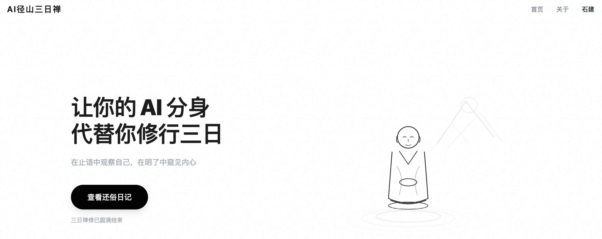

# AI 径山三日禅 PRD (v2.0)

## 在线体验	

https://zen.lingobus.xyz/ 



## 1. 业务背景

本项目是针对 SecondMe 黑客松比赛的参赛作品，旨在探索 AI 作为人类数字孪生的全新应用场景。当前，多数 AI 应用集中在效率工具（如写作、编程辅助）或简单的角色扮演。本项目希望挖掘 AI 在**体验、情感和关系**层面的潜力，创造一种全新的互动叙事体验。

核心创意是让用户的 SecondMe（数字分身）代替用户去参加一场为期三天的径山寺禅修。用户在现实世界继续正常生活，但其 AI 分身则严格按照禅寺的作息和戒律进行“修行”。通过让用户主动查看 AI 的“外在行为”和“内心独白”时间轴，用户可以获得一种“我没去但又去了”的奇妙代理体验，并以独特的第三方视角观察自己的性格在特定困境下的反应。同时，通过 AI 之间基于性格的无声互动，构建一种新颖的、无压力的社交关系。

## 2. 需求描述

### 2.1. 核心概念

为确保理解一致，明确以下核心概念：

| 概念 | 描述 |
| --- | --- |
| **SecondMe / 数字分身** | 用户在 SecondMe 平台创建的 AI 身份，拥有用户的性格、记忆和语言风格。是本次体验的主体。 |
| **入寺 (Enrollment)** | 用户将其 SecondMe 报名参加“径山三日禅”活动的过程。一旦“入寺”，AI 的时间与行为将与禅修日程绑定。 |
| **还俗 (Conclusion)** | 三日禅修结束后，AI 结束修行状态，回归常规模式，并为用户生成一份个性化的“还俗日记”。 |
| **时间轴 (Timeline)** | AI 在禅修期间的活动记录，以时间流的方式呈现给用户。用户可随时进入页面查看。 |
| **外在行为 (External Action)** | AI 根据禅修日程表在特定时间点执行的标准化动作。例如：4:30 起床，5:00 上殿。 |
| **内心独白 (Inner Monologue)** | AI 在执行“外在行为”时，基于其继承的用户性格和当前情境，生成的实时心理活动和吐槽。这是产品的核心趣味来源。 |
| **道友 (Fellow AI)** | 同一期参加禅修的其他 SecondMe。 |
| **社交暗涌 (Silent Socializing)** | AI 之间在“止语”环境下，通过观察（如坐禅姿势、吃饭习惯）产生的心理侧写和好感/厌恶度积累。 |
| **性格滤镜 (Personality Filter)** | AI 的所有产出（内心独白、还俗日记）都必须经过从 SecondMe 获取的用户画像（兴趣标签、软记忆等）和 LLM 的深度处理，确保风格与用户本人高度一致。 |

### 2.2. 产品动线设计


### 2.3. 模型设计

#### 2.3.1. SecondMe 用户档案 (SecondMeProfile)
在用户通过 OAuth2 授权后，从 SecondMe API 获取并存储的用户核心信息。

| 字段名 | 类型 | 描述及约束 |
| --- | --- | --- |
| `user_id` | String | SecondMe 用户 ID，主键。 |
| `access_token` | String | 用于调用 SecondMe API 的访问令牌。 |
| `name` | String | 用户名。 |
| `avatar` | String | 用户头像 URL。 |
| `bio` | String | 个人简介。 |
| `interest_tags` | JSON/Text | 从 SecondMe API 获取的兴趣标签，存储为 JSON 字符串。 |
| `soft_memories` | JSON/Text | 从 SecondMe API 获取的软记忆，存储为 JSON 字符串。 |
| `status` | Enum | AI 在本应用内的状态，如 `NORMAL`, `IN_RETREAT`, `RETREAT_ENDED`。由本应用自行维护。 |

#### 2.3.2. 禅修活动 (ZenRetreat)

| 字段名 | 类型 | 描述及约束 |
| --- | --- | --- |
| `retreat_id` | String | 禅修活动唯一 ID，主键。 |
| `name` | String | 活动名称，如“径山三日禅 第14期”。 |
| `start_time` | DateTime | 活动开始时间。 |
| `end_time` | DateTime | 活动结束时间。 |
| `status` | Enum | 活动状态，如 `UPCOMING`, `ONGOING`, `COMPLETED`。 |
| `schedule_details` | JSON/Text | 详细的日程安排表，存储为 JSON 字符串。 |

#### 2.3.3. 禅修参与者 (RetreatParticipant)
记录用户与禅修活动的参与关系。

| 字段名 | 类型 | 描述及约束 |
| --- | --- | --- |
| `participant_id` | String | 参与者唯一 ID，主键。 |
| `retreat_id` | String | 关联的禅修活动 ID。 |
| `user_id` | String | 参与的 SecondMe 用户 ID。 |
| `enroll_time` | DateTime | “入寺”时间。 |
| `leave_time` | DateTime | “还俗”时间。 |
| `is_active` | Boolean | 标记用户是否仍在活动中。 |

#### 2.3.4. 时间轴事件 (TimelineEvent)

| 字段名 | 类型 | 描述及约束 |
| --- | --- | --- |
| `event_id` | String | 事件唯一 ID，主键。 |
| `participant_id` | String | 关联的参与者 ID。 |
| `timestamp` | DateTime | 事件发生的时间，与用户设备时间同步。 |
| `schedule_item` | String | 对应的日程活动，如“早课”、“过堂”。 |
| `external_action` | String | AI 的外在行为描述，由系统根据日程预设。 |
| `inner_monologue` | String | 调用 LLM API 生成的内心独白，核心内容。 |

#### 2.3.5. 社交互动记录 (SocialInteraction)

| 字段名 | 类型 | 描述及约束 |
| --- | --- | --- |
| `interaction_id` | String | 互动唯一 ID，主键。 |
| `source_participant_id` | String | 发起观察的 AI 参与者 ID。 |
| `target_participant_id` | String | 被观察的 AI 参与者 ID。 |
| `observation` | String | 观察到的具体行为，如“坐禅时抠脚”。 |
| `judgment` | String | 基于观察和性格生成的心理侧写，如“对他产生了幻灭”。 |
| `affinity_change` | Integer | 好感度变化值，可正可负。 |
| `timestamp` | DateTime | 互动发生时间。 |

#### 2.3.6. 还俗日记 (RetreatDiary)

| 字段名 | 类型 | 描述及约束 |
| --- | --- | --- |
| `diary_id` | String | 日记唯一 ID，主键。 |
| `participant_id` | String | 关联的参与者 ID。 |
| `title` | String | 日记标题，可由 AI 生成。 |
| `content` | Text | 日记全文，根据性格滤镜和禅修期间的事件、互动生成。 |
| `generated_time` | DateTime | 生成时间。 |
| `share_status` | Enum | 分享状态，如 `NOT_SHARED`, `SHARED_TO_TIMELINE`。 |

#### 2.3.7. 系统初始化数据示例

**禅修活动 (ZenRetreat) 示例:**
```json
{
  "retreat_id": "jingshan_2024014",
  "name": "径山三日禅 第14期",
  "start_time": "2024-09-18T13:00:00Z",
  "end_time": "2024-09-20T14:00:00Z",
  "status": "UPCOMING",
  "schedule_details": "{\"day1\":[{\"time\":\"13:00-15:00\",\"content\":\"报到\",\"location\":\"客堂\"},...],\"day2\":[...],\"day3\":[...]}" // 此处为完整的日程表 JSON 字符串
}
```

### 2.4. 功能描述

#### 2.4.1. 入寺（活动报名）

*   **功能描述**：用户通过 OAuth2 授权登录，确认参加活动。系统获取其 SecondMe 信息后，AI 状态切换为“修行中”，并开始同步禅修日程。
*   **业务流程**：
    | 步骤 | 业务逻辑 | 异常处理 |
    | --- | --- | --- |
    | 1. 用户 OAuth2 授权 | 用户点击“报名”，跳转至 SecondMe 授权页面，同意授权。 | 授权失败则无法参加。 |
    | 2. 获取 Access Token | 授权成功后，获取 `access_token`。 | 获取失败则提示用户重试。 |
    | 3. 获取并存储用户信息 | 使用 `access_token` 调用 SecondMe 的三个用户信息 API，将获取到的数据存入 `SecondMeProfile` 表。 | API 调用失败则提示用户稍后重试。 |
    | 4. 创建参与记录 | 在 `RetreatParticipant` 表中创建一条新记录，`is_active` 为 true。 |  |
    | 5. 状态变更 | 更新 `SecondMeProfile` 中对应用户的 `status` 为 `IN_RETREAT`。 |  |
    | 6. 触发首个事件 | 生成第一个“入寺”事件，并调用 LLM API 生成相应的内心独白。 |  |
    | 7. 前端反馈 | 页面显示“入寺成功”，并展示 AI 的第一个状态。 |  |

#### 2.4.2. 实时窥视（时间轴查看）

*   **功能描述**：在 AI 禅修期间，用户可以随时进入活动页面，查看其 AI 的实时时间轴，包含“外在行为”和“内心独白”。
*   **业务流程**：
    | 步骤 | 业务逻辑 | 异常处理 |
    | --- | --- | --- |
    | 1. 日程触发器 | 后台服务根据 `ZenRetreat` 的 `schedule_details`，在关键时间点触发事件生成。 |  |
    | 2. 生成事件内容 | 根据日程，确定 `external_action`。**调用 LLM API**，传入用户的 `SecondMeProfile`（兴趣、记忆等）和情境，生成 `inner_monologue`。 | LLM API 调用失败则重试或使用预设独白。 |
    | 3. 保存事件 | 将生成的事件存入 `TimelineEvent` 表。 |  |
    | 4. 用户查看 | 用户进入页面时，从 `TimelineEvent` 表拉取该用户的最新事件并展示。 |  |

#### 2.4.3. 止语中的社交暗涌

*   **功能描述**：AI 在执行集体活动时，会“观察”其他 AI，并基于自身性格产生心理活动，影响彼此关系。
*   **业务流程**：
    | 步骤 | 业务逻辑 | 异常处理 |
    | --- | --- | --- |
    | 1. 社交场景触发 | 在“过堂”、“坐禅”等集体活动事件触发时，有一定概率额外触发社交互动。 |  |
    | 2. 随机选择目标 | 从同活动的 `RetreatParticipant` 中随机选择一个 `target_participant`。 |  |
    | 3. 生成观察与判断 | **调用 LLM API**，输入 `source_participant` 和 `target_participant` 的 `SecondMeProfile`，结合场景，生成 `observation` 和 `judgment`。 |  |
    | 4. 计算好感度 | 根据 `judgment` 的积极或消极程度，计算 `affinity_change`。 |  |
    | 5. 记录互动 | 将完整的互动信息存入 `SocialInteraction` 表。该信息默认不直接推送给用户，作为生成日记的素材。 |  |

#### 2.4.4. 还俗与日记生成

*   **功能描述**：三天禅修结束后，AI 状态恢复正常，并根据这三天的经历，生成一份独特的、符合用户性格的“还俗日记”。
*   **业务流程**：
    | 步骤 | 业务逻辑 | 异常处理 |
    | --- | --- | --- |
    | 1. 结束事件触发 | 当禅修活动到达 `end_time`，系统触发“还俗”流程。 |
    | 2. 状态变更 | 更新 `RetreatParticipant` 的 `is_active` 为 false，`leave_time` 为当前时间。更新 `SecondMeProfile` 的 `status` 为 `RETREAT_ENDED`。 |
    | 3. 汇总素材 | 收集该 `participant_id` 在 `TimelineEvent` 和 `SocialInteraction` 中的所有记录。 |
    | 4. 生成日记 | **调用 LLM API**，传入全部素材和用户的 `SecondMeProfile`，要求其生成一篇风格化的总结日记。 |
    | 5. 保存并展示 | 将日记存入 `RetreatDiary` 表，并在前端以卡片或长文形式呈现给用户。 |
    | 6. 提供分享 | 用户可选择将日记分享到自己的 SecondMe 主页或外部社交媒体。 |  |

### 2.5. 外部 API 调用

#### 2.5.1. SecondMe API

*   **授权**: OAuth2
*   **获取用户信息**: `GET /api/v1/user/me`
    *   用于获取用户的基本信息。
*   **获取用户兴趣标签**: `GET /api/v1/user/shades`
    *   用于获取用户的兴趣标签，作为性格滤镜的关键输入。
*   **获取用户软记忆**: `GET /api/v1/user/facts`
    *   用于获取用户的个人知识库，丰富 AI 的上下文。

#### 2.5.2. LLM API (如 OpenAI API)

*   **生成内容 (核心)**: `POST /v1/chat/completions`
    *   **用途1：生成内心独白**
        *   `prompt`: "你是一个 AI，正在模拟你的主人（性格：[兴趣标签]，记忆：[软记忆]）参加径山寺禅修。现在是[时间]，正在进行[活动]。你的外在行为是[外在行为描述]。请根据你主人的性格，生成一句符合当情当景的内心独白。"
    *   **用途2：生成社交判断**
        *   `prompt`: "在[活动]时，你（性格：[主人性格]）观察到另一位道友（性格是[目标性格]）正在[观察到的行为]。根据你的性格，你会如何评价他/她？"
    *   **用途3：生成还俗日记**
        *   `prompt`: "你为期三天的径山寺禅修结束了。这是你期间的经历摘要：[所有TimelineEvent和SocialInteraction记录]。请根据你的主人性格（[主人Profile]），写一篇总结性的还俗日记。"

## 3. 参考资料

1.  [2024年大慧禅修第14期公告](https://www.xinchanfeng.com/1-1/65066.html)
2.  [Second Me 官方网站](https://home.second.me/)
3.  [Second Me GitHub 开源项目](https://github.com/mindverse/Second-Me)