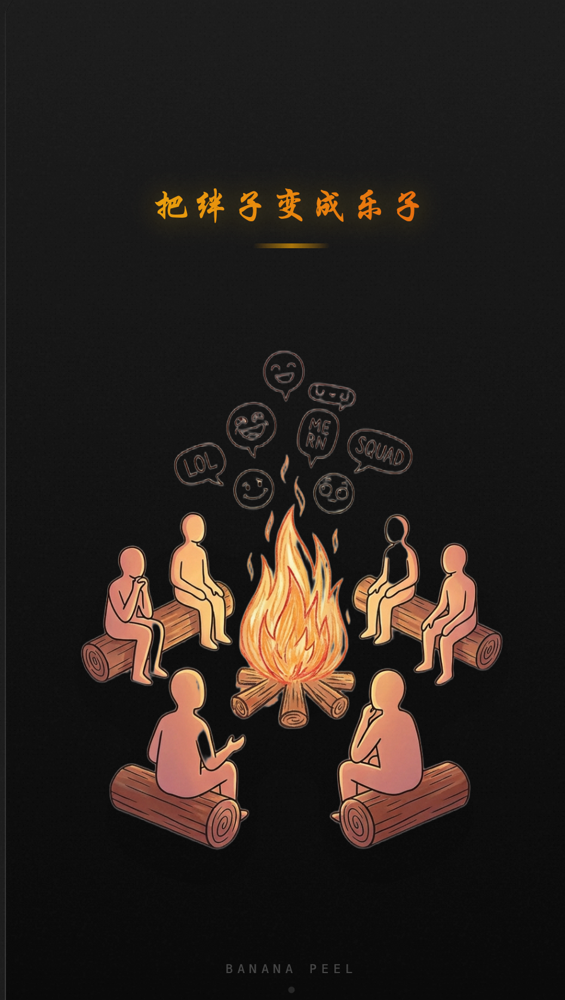

> 本文正在参与「GEEK AI｜2025年度AI应用创新挑战赛」，动手尝试 “1 个人开发 1 个产品”

### 产品试用：http://banana.lingobus.xyz/

### 省流 PPT 产品介绍
 [请点击查看：香蕉皮，把绊子变成乐子](assets/vc_香蕉皮_把绊子变成乐子.pdf) 

### Banana（香蕉皮）：把生活给你的绊子，变成个乐子

#### 1. 解决什么问题

生活中常有一些令人心塞的“小确丧”。
比如赶工时电脑突然黑屏，或者像我们演示的那样，本想穿着新鞋冲刺 KPI，结果鞋底先“罢工”了。

面对这些尴尬瞬间，我们往往陷入一种表达困境：发朋友圈显得过于矫情，仿佛连这点小挫折都无法自我消化；但独自憋在心里，又确实令人郁结难舒。

**“香蕉皮”正是为了承接这些瞬间而生。**
我们不提供说教式的“正能量”，而是打造一个深夜的路边摊。在这里，用户可以卸下防备，将那些倒霉事倾诉出来，并将其转化为幽默的段子。我们解决的并非倒霉本身，而是那种**“仿佛全世界只有我一人在受难”的孤独感**。当尴尬被公开表达并获得共鸣时，负面情绪也就随之消解了。

#### 2. 目标用户是谁

我们的核心用户是当下的年轻人，特别是那群**习惯用幽默消解压力、在深夜寻找真实共鸣的人**。

在日常社交中，他们或许是情绪稳定的成年人，但在内心深处，他们渴望一个能放下包袱、匿名吐槽、且能得到回应的空间。在这里，大家都是**“正在经历水逆的普通人”**。这种“同病相怜”的氛围，往往比严肃的心理咨询更能带来即时的解压效果。

#### 3. 产品核心思路和创新点

市面上的树洞类产品往往面临“内容压抑”或“社区冷清”的困境。我们利用 AI 技术，重构了内容生产与社区氛围的逻辑：

- **变废为宝的“梗图引擎”**：
  我们极大地降低了表达门槛。用户只需上传一张惨遭不幸的现场照，AI 便能迅速生成一张**黑白漫风格的梗图**，并附赠一句扎心的文案。这种将悲剧转化为喜剧的处理方式，本身就是对用户的第一层治愈。

- **语义匹配的“火堆”社交**：
  用户发布的内容不会石沉大海。系统利用 LLM 的语义理解能力，计算内容的相似度，将用户精准投递到与其遭遇相似的“吸烟室”话题中。
  例如，因 #KPI崩了# 而来的用户，会发现房间里聚集的都是职场失意人。大家围着火堆聊 15 分钟，时间一到，火灭人散，聊天记录清除。**没有建立长期关系的社交压力，只有那一刻“我懂你”的默契。**

- **绝不冷场的“AI 酒保”**：
  针对社区冷启动的痛点，我们内置了 AI 酒保（角色名：老蕉）进行实时巡逻。
  他并非只会机械回复的客服，而是一个具备“毒舌”与“温情”双重特质的角色。如果房间内 2 分钟无人发言，他会结合上下文主动挑起话题，甚至引用前一位客人的故事来安慰当前用户。**他不仅是陪聊者，更是社区氛围的串联者，确保每个孤独的灵魂都能得到回应。**

- **有温度的互动机制**：
  我们摒弃了虚荣的点赞计数，将互动简化为**“敬一杯”**或**“递个纸”**。这些互动文案均由 AI 根据具体情境生成，或戳心或逗趣，旨在传递真实的温度而非冰冷的数据。

#### 4. 未来想象空间

“香蕉皮”不仅仅是一个工具，它的未来形态将更加丰富：

- **多模态进化**：
  目前的梗图只是起点。未来，AI 可以根据用户的倒霉经历，实时生成短视频或语音脱口秀。这种动态的视觉与听觉冲击，将使“乐子”更具传播力，让用户的自我调侃在社交网络中引发更广泛的共鸣。

- **情绪疗愈闭环**：
  通过对用户长期上传内容的语义分析，AI 将能够生成“月度/年度情绪报告”，分析用户的情绪周期。若发现用户持续低落，AI 甚至能化身为专业的情绪导师，提供 1V1 的疏导服务，实现从“宣泄”到“治愈”的服务闭环。

- **山洞—跨越时空**：
  我们计划推出“山洞”功能，让用户能找到数年前经历过同样困境的人，并模拟“遥远过去”的视角进行回复。这种穿越时间的对话，能让用户产生一种宏大的释然感——眼下的烦恼，置于时间长河之中，终将成为过去。

---

### 附录：竞对分析与市场逻辑

我们认为“香蕉皮”拥有真实的市场需求与底层逻辑支撑：

#### (1) 真实的市场热度：倒霉事是天然流量池

在小红书等平台上，搜索“倒霉事”或“比惨大赛”，往往能看到互动量极高的爆款内容。这反映出大众已经厌倦了精致的滤镜，转而追求**真实的粗粝感**。
早期的 [**FMYLife.com**](http://FMYLife.com) 虽然验证了“分享不幸”是全球刚需，但它停留在 Web 2.0 时代的纯文字模式，互动滞后且缺乏二次创作能力。我们要做的是移动时代的升级版。

#### (2) AI 陪伴产品的市场验证

**Talkie** 或 [**Character.ai**](http://Character.ai) 等产品的爆发，证明了用户并不执着于“真人交流”。只要 AI 足够智能、具备共情能力，用户愿意投入大量时间进行情感交互。

#### (3) 为什么 LLM 是这款产品的“技术变量”？

大模型（LLM）的出现，彻底重构了这个赛道：

1. **从“静态阅读”到“幽默共创”**：过去需要用户具备幽默感才能写出段子，现在 AI 接管了创作，降低了社交门槛。

2. **彻底解决“冷启动”**：传统社交产品往往死于初期无人互动的寂静，但有了 **AI 酒保（老蕉）** 驻场，即便深夜只有一个用户，也能享受到高质量、不冷场的对话体验。

3. **精准的情绪匹配**：依靠 **LLM 的语义理解**，系统能瞬间将两个遭遇相似的人（比如都踩了香蕉皮）送进同一个火堆，这种基于“情绪颗粒度”的匹配效率，是传统标签检索无法比拟的。